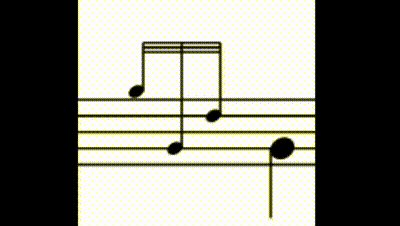

# PipeScore

## A bagpipe notation app

PipeScore is a free, easy-to-use, online bagpipe notation application. [Use it here!](https://pipescore.web.app)

PipeScore's unique feature is reactive gracenotes - pipe embellishments that automatically update when you change the note that they are on. This means gracenotes can be added in sets (e.g. 'add a doubling to this note') rather than the user having to individually pick the correct one.



[Watch the video](https://pipescore.web.app/help) for an introduction to using PipeScore.

PipeScore is powered by:

- [typescript](https://www.typescriptlang.org)
- [mithril](https://mithril.js.org) for rendering
- [firebase](https://firebase.google.com) for saving, user accounts, and hosting, via the following libraries:
  - [firebase-auth-lite](https://github.com/samuelgozi/firebase-auth-lite)
  - [firebase-firestore-lite](https://github.com/samuelgozi/firebase-firestore-lite)
- [esbuild](https://github.com/evanw/esbuild) for building
- [biome](https://biomejs.dev) for linting
- [prettier](https://prettier.io) for code formatting

## Features

- Reactive embellishments - a faster way to input gracenotes
- Automatic note grouping and spacing
- Sharing using URLs
- Playback
- Ties, triplets, time signatures, text boxes
- Parts, repeats, second timings
- Harmonies
- Multiple tunes and pages
- Undo / Redo
- Importing/exporting from the Bagpipe Music Writer format
- Exporting to PDF
- Cloud saving, downloading and uploading of files
- Built-in documentation, as well as a comprehensive help page
- Multi-language interface (currently English and French)
- Intuitive user interface for all of the above
- ~16000 lines of code (including tests)

## Documentation

See `src/PipeScore/README.md` for documentation.

[This manual](http://bagpipe.ddg-hansa.com/Bagpipe_Reader.pdf) is a helpful guide to BWW files.

## Running locally

You will need:

- `python3` (and `pip3`)
- `npm`

To install dependencies, run:

```bash
$ npm install            # install JS dependencies
$ pip3 install svgwrite  # install svgwrite, for building icons
```

To build JS files, icons and HTML pages, run:

```bash
$ npm run build     # build JS, static pages and icons
```

Run the following commands to run locally, ideally in separate terminals:

```bash
$ npm run dev       # run the development server
$ npm run watch     # rebuild JS on changes
$ npx tsc --watch   # typecheck
```

To build a production JS bundle run:

```bash
$ npm run build    # build minified bundle
```

## Contributors

Thank you to any and all who have contributed code to PipeScore!

- [benjaminelliot](https://github.com/benjaminelliot) - the initial implementation of BWW file parsing
- [HerveDubois](https://github.com/HervePierreDubois) - translations of gracenote names into French
